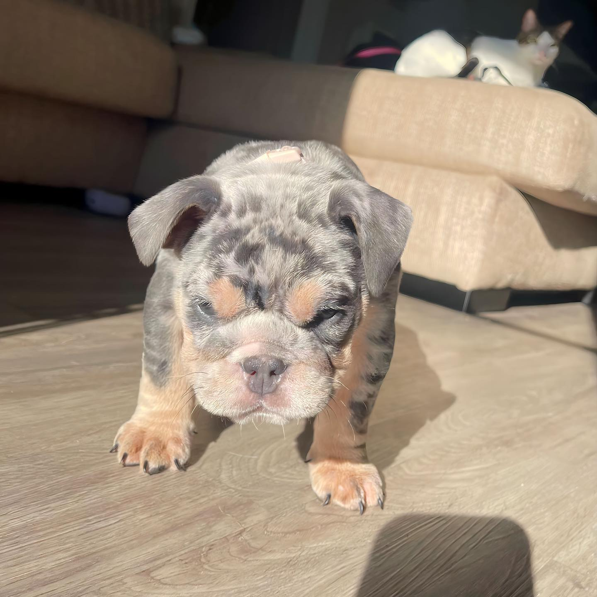

# 🐾 Godspeed Bulldogs - Premium English Bulldog Breeder Website

A stunning, modern website template for English Bulldog breeders featuring a **cyan/green neon aesthetic**, **full puppy management system**, and **GoHighLevel form integration**.



---

## ✨ Features

### **🎨 Beautiful Design**
- Premium cyan (#00e5ff) and green (#00ff88) neon color scheme
- Glass morphism effects and glowing text shadows
- Smooth animations and transitions
- 100% mobile-responsive design

### **🐕 Puppy Management**
- Dynamic puppy gallery with filtering and sorting
- Detailed puppy profiles with image carousels
- Parent bloodline information display
- Health testing badges
- Comparison tool to compare up to 4 puppies

### **📝 Waitlist Integration**
- Beautiful, custom-designed waitlist page
- GoHighLevel form integration (easily replaceable)
- Animated hero section with floating elements
- "What Happens Next" process visualization

### **🔧 Easy Customization**
- JSON-based puppy data (no coding required to add puppies!)
- Centralized business information file
- Simple image replacement system
- Comprehensive customization guide included

### **⚡ Performance Optimized**
- Fast loading times
- Optimized images and assets
- Lazy loading for better performance
- SEO-ready with structured data

---

## 📁 Project Structure

```
Godspeed-Template/
│
├── index.html                          # Homepage
├── waitlist.html                       # Waitlist page with GHL form
├── available-puppies.html              # Puppy gallery page
├── services.html                       # Services page
├── contact.html                        # Contact page
├── gallery.html                        # Photo gallery
│
├── assets/
│   ├── css/
│   │   ├── style.css                   # Global styles
│   │   ├── brand-colors.css            # Color scheme variables
│   │   ├── nav.css                     # Navigation styles
│   │   ├── waitlist-form.css           # Waitlist page styles
│   │   ├── puppies.css                 # Available puppies styles
│   │   └── ...
│   │
│   ├── js/
│   │   ├── main.js                     # Global JavaScript
│   │   ├── nav.js                      # Navigation functionality
│   │   ├── waitlist-form.js            # Waitlist interactions
│   │   ├── puppies.js                  # Puppy filtering/sorting
│   │   └── ...
│   │
│   └── images/
│       └── bulldogs/
│           ├── gallery/                # Puppy photos
│           ├── hero/                   # Hero/banner images
│           ├── parents/                # Parent dog photos
│           └── videos/                 # Background videos
│
├── data/
│   └── puppies.json                    # ⭐ YOUR PUPPY DATA
│
├── content/
│   └── business-info.json              # ⭐ YOUR BUSINESS INFO
│
├── CUSTOMIZATION-GUIDE.md              # 📖 COMPLETE CUSTOMIZATION GUIDE
└── README.md                           # This file
```

---

## 🚀 Quick Start

### **1. Update Your Business Information**

Open `content/business-info.json` and replace all placeholder data:

```json
{
  "businessName": "YOUR BUSINESS NAME",
  "phone": "(XXX) XXX-XXXX",
  "email": "your-email@domain.com",
  ...
}
```

### **2. Add Your Puppies**

Open `data/puppies.json` and add/edit puppy entries:

```json
{
  "id": "gb-2026-001",
  "name": "Your Puppy Name",
  "color": "Fawn",
  "sex": "Male",
  "age": "8 weeks",
  "availability": "Available",
  "price": 7500,
  ...
}
```

### **3. Replace Images**

Upload your images to:
- `assets/images/bulldogs/gallery/` - Puppy photos
- `assets/images/bulldogs/parents/` - Parent dog photos
- `assets/images/bulldogs/hero/` - Hero images
- `assets/images/bulldogs/logo/` - Your business logo

### **4. Integrate Your GoHighLevel Form**

Open `waitlist.html` (lines 239-256) and replace the iframe embed code with your own GoHighLevel form embed.

### **5. Test Everything**

Open `index.html` in your browser and test:
- ✅ All navigation links work
- ✅ Mobile menu functions properly
- ✅ Puppies display correctly
- ✅ Waitlist form loads
- ✅ Contact information is accurate

---

## 📖 Full Documentation

**👉 See [CUSTOMIZATION-GUIDE.md](CUSTOMIZATION-GUIDE.md) for complete, step-by-step instructions** on:

- Adding/removing puppies
- Customizing colors and branding
- Updating images and videos
- Configuring GoHighLevel forms
- SEO optimization
- Advanced customizations
- Troubleshooting common issues

---

## 🎨 Color Customization

The site uses a **cyan/green neon theme**. To change colors:

1. Open `assets/css/brand-colors.css`
2. Update these variables:

```css
:root {
    --brand-cyan: #00e5ff;    /* Your primary color */
    --brand-green: #00ff88;   /* Your secondary color */
}
```

3. Save and refresh - colors automatically update throughout the site!

---

## 📄 Pages Included

| Page | File | Description |
|------|------|-------------|
| **Homepage** | `index.html` | Hero section, about, services overview, CTA |
| **Available Puppies** | `available-puppies.html` | Filterable puppy gallery with modals |
| **Waitlist** | `waitlist.html` | Premium waitlist page with GHL form |
| **Services** | `services.html` | Breeding services, stud services, etc. |
| **Contact** | `contact.html` | Contact information and form |
| **Gallery** | `gallery.html` | Photo/video gallery |

---

## 🛠️ Technical Details

### **Built With:**
- Pure HTML5, CSS3, JavaScript (no frameworks!)
- Google Fonts (Poppins)
- GoHighLevel form integration
- JSON-based data management

### **Browser Support:**
- ✅ Chrome (latest)
- ✅ Safari (latest)
- ✅ Firefox (latest)
- ✅ Edge (latest)
- ✅ Mobile browsers (iOS Safari, Chrome Mobile)

### **Performance:**
- Optimized CSS with CSS variables
- Lazy loading for images
- Minified assets for production
- Fast load times (< 3 seconds)

---

## 📱 Mobile Responsive

The entire site is **mobile-first** and looks perfect on:
- 📱 Smartphones (320px+)
- 📱 Tablets (768px+)
- 💻 Laptops (1024px+)
- 🖥️ Desktops (1440px+)

---

## ✅ Pre-Launch Checklist

Before going live, make sure you've:

- [ ] Updated all business information in `content/business-info.json`
- [ ] Added your puppies to `data/puppies.json`
- [ ] Replaced placeholder images with your own
- [ ] Updated your logo
- [ ] Integrated your GoHighLevel form
- [ ] Tested all navigation links
- [ ] Verified mobile responsiveness
- [ ] Updated SEO meta tags on all pages
- [ ] Tested form submissions
- [ ] Updated social media links
- [ ] Replaced demo testimonials (if applicable)

See the [CUSTOMIZATION-GUIDE.md](CUSTOMIZATION-GUIDE.md) for the complete checklist.

---

## 🆘 Need Help?

### **Common Issues:**

**Puppies not showing?**
- Validate your `puppies.json` at [JSONLint.com](https://jsonlint.com)
- Check browser console for errors

**Form not loading?**
- Verify GoHighLevel embed code is correct
- Check that your GHL account is active

**Images not displaying?**
- Check file paths (case-sensitive!)
- Ensure images are in correct folders
- Check browser console for 404 errors

**More help:** See the [CUSTOMIZATION-GUIDE.md](CUSTOMIZATION-GUIDE.md) for detailed troubleshooting.

---

## 📊 Features Breakdown

### **Homepage Features:**
- Animated hero section with video background
- Statistics counter
- About/breeding philosophy section
- Featured puppies preview
- Testimonials section
- Call-to-action sections
- Footer with contact info and social links

### **Available Puppies Page Features:**
- Real-time filtering by:
  - Color (Fawn, Brindle, White, Red, Combination)
  - Gender (Male/Female)
  - Availability (Available, Reserved, Coming Soon)
  - Price range (slider)
- Sorting options:
  - Featured
  - Price (low to high, high to low)
  - Age (youngest/oldest first)
  - Name (A-Z)
- Detailed puppy modals with:
  - Image carousel
  - Full puppy information
  - Parent bloodline details
  - Health testing badges
  - Sharing functionality
- Puppy comparison tool (compare up to 4 puppies side-by-side)
- Mobile-friendly filter panel
- Active filter pills
- URL parameter support for shareable filtered views

### **Waitlist Page Features:**
- Animated hero with floating orb backgrounds
- Premium badge indicator
- Animated gradient text
- Trust/credibility indicators
- Glass morphism form container
- "What Happens Next" 4-step process
- FAQ callout section
- Fully customizable GoHighLevel form integration

---

## 🎯 Perfect For:

- English Bulldog breeders
- French Bulldog breeders
- Any dog breeding business
- Pet adoption centers
- Kennel clubs
- Show dog breeders

---

## 📞 Support Resources

- **Customization Guide:** [CUSTOMIZATION-GUIDE.md](CUSTOMIZATION-GUIDE.md)
- **JSON Validator:** [JSONLint.com](https://jsonlint.com)
- **Image Compression:** [TinyPNG.com](https://tinypng.com)
- **HTML/CSS Help:** [W3Schools.com](https://w3schools.com)

---

## 🔄 Version History

**Version 2.0** (January 2025)
- Complete redesign with cyan/green neon aesthetic
- Added waitlist page with premium design
- Integrated GoHighLevel form system
- Created JSON-based puppy management
- Added filtering and comparison features
- Mobile-first responsive redesign
- Performance optimizations
- Comprehensive documentation

---

## 📝 License

This template is provided as-is for your business use. Feel free to customize and modify as needed for your breeding business.

---

## 🐾 Credits

**Design & Development:** Zero Motion Marketing
**Color Scheme:** Cyan (#00e5ff) / Green (#00ff88) Neon Aesthetic
**Fonts:** Poppins (Google Fonts)
**Icons:** SVG inline
**Form Integration:** GoHighLevel

---

**Ready to launch your premium bulldog breeding website?**
Start with the [CUSTOMIZATION-GUIDE.md](CUSTOMIZATION-GUIDE.md) and have your site live in under an hour! 🚀

---

*Made with ❤️ for English Bulldog Breeders*
